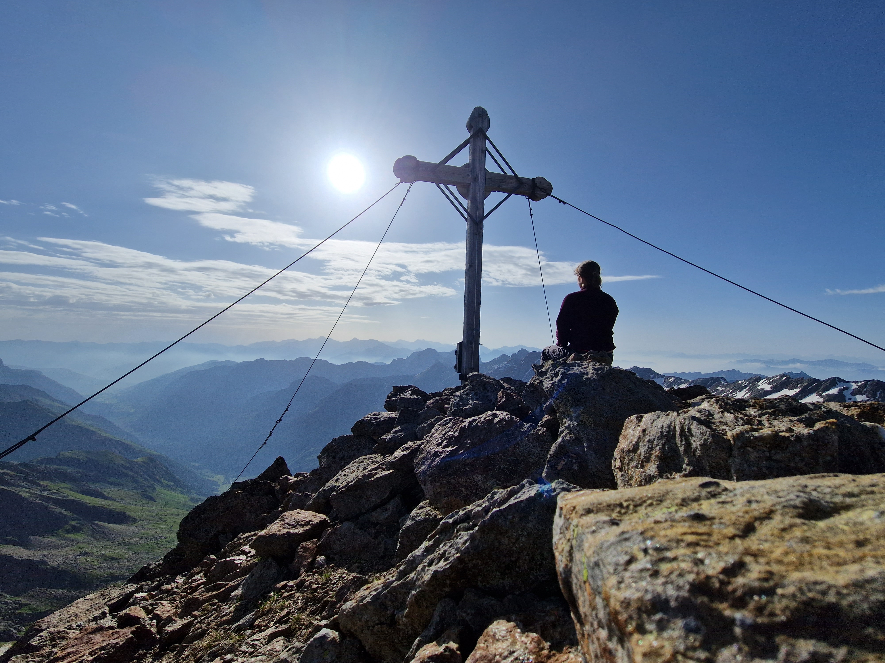

  <table cellspacing="0" width="100%">
  
   <b>Judith Lutz</b>
       
       
      
 
    

    Contact:~@posteo.de (replace ~ by judith lutz without the space)
    
   

  
     
 
I am currently working in the mountains in Austria for a gap summer. Here is my
<a
 href="cvtest.pdf"
 name="cvtest.pdf">CV</a> (updated August 2025).
 

<h3>Careerpath</h3>

After my undergraduate in mathematical physics and mathematics, followed by a master in mathematics, I recently finished my PhD this year in algebraic number theory. My thesis focuses on rational Witt spaces and their relationship with diamonds and the Fargues-Fontaine curve. 
I would like to apply my research skills in the future to a topic with more real world application. 
 

<h3>Teaching</h3>
<ul
style="list-style-type:circle">
  <li> 
  Summer term 2023 (University of Münster): Seminar on perfectoid spaces (aimed for master students)
  </li>
 
<li> 
  Summer term 2022 (University of Münster): Seminar on elliptic curves (aimed for master students)
  </li>
 

